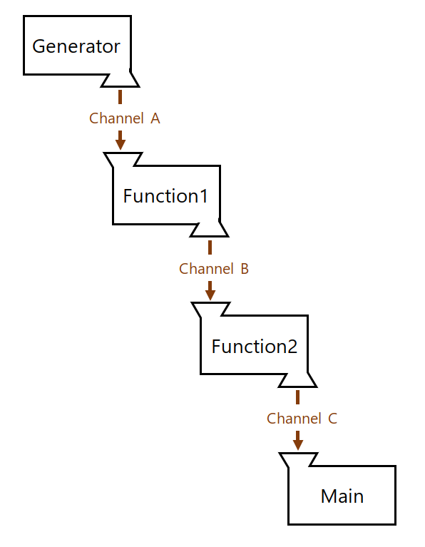
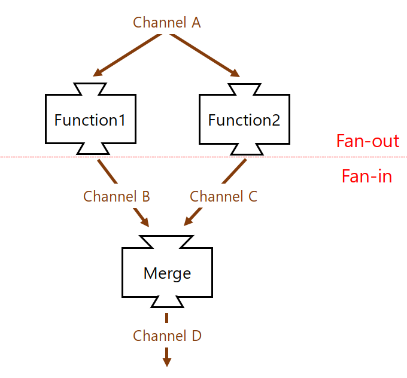

# 개념 정리 (6월 2주차) - Pipeline, Context

## Pipeline and cancellation

*참고 링크: <https://blog.golang.org/pipelines>*

### Pipeline 이란?

</img>

- 파이프라인은 채널에 의해 연결된 일련의 단계로, 각 단계는 동일한 기능을 실행하는 고루틴의 그룹이다.
- 맨 첫 단계와 맨 마지막 단계를 제외한 각 단계에는 인바운드 채널과 아웃바운드 채널이 있다.
- 첫 번째 단계는 아웃바운드 채널만 있으며, source 또는 생산자라고 불린다.
- 마지막 단계는 인바운드 채널만 있으며, sink 혹은 소비자라고 불린다.

- 각 단계에서 고루틴이 하는 일은 다음과 같다.
    - 인바운드 채널을 통해 업스트림에서 값을 수신한다.
    - 수신한 데이터에 대해 어떠한 기능을 수행한다. (대개 새로운 값을 생산함)
    - 생산한 값을 아웃바운드 채널을 통해 다운스트림으로 전송한다.

<br>

*실습 예제: Pipeline_basic.go*

<br>

### Fan-out, Fan-in

</img>

- fan-out: 여러 개의 함수가 동일한 하나의 채널을 그 채널이 닫힐 때까지 읽을 수 있는 것
    - 이것은 CPU 사용과 I/O를 병행하기 위해 작업 그룹 간에 작업을 분배하는 방법을 제공한다.
- fan-in: 하나의 함수가 여러 입력을 읽을 수 있으며, 모든 입력 채널이 닫힐 때까지 실행할 수 있는 것
    - 모든 입력들이 닫힐 때 비로소 닫히는 단일 채널로 입력 채널을 멀티플렉싱한다.
- (추가) sync.WaitGroup: 모든 고루틴이 종료될 때 까지 대기해야 할 때 사용한다.
    - func (wg *WaitGroup) Add(delta int): WaitGroup에 대기중인 고루틴 개수를 추가한다.
    - func (wg *WaitGroup) Done(): 대기중인 고루틴의 수행이 종료됨을 알려준다.
    - func (wg *WaitGroup) Wait(): 모든 고루틴이 종료될 때까지 대기한다.

<br>

*실습 예제: Pipeline_fanin_fanout.go*

<br>

### Explicit cancellation

지금까지의 예제에서 파이프라인은 모든 전송 작업이 완료되면 아웃바운드 채널을 닫았고,
<br>인바운드 채널에서 해당 채널이 닫힐 때까지 계속해서 값을 수신했다.
<br>이 패턴은 각 수신 단계를 range 루프로 쓸 수 있도록 하며,
<br>모든 값이 다운스트림으로 성공적으로 전송되면 모든 고루틴이 종료되도록 보장한다.
<br>
<br>하지만 실제 파이프라인에선 각 단계가 항상 모든 인바운드 값을 받지는 않는다.
<br>함수에서 인바운드 값의 일부만 필요할 수도 있고, 이전 단계에서 에러가 검출되어 이전 단계가 일찍 중단될 수도 있기 때문이다.
<br>
<br>예를 들어, 한 단계에서 모든 인바운드 값을 소비하지 못하면 그 값을 보내는 고루틴은 무기한으로 block 상태가 될 수 밖에 없다.
<br>**고루틴은 garbage collection이 되지 않기 때문에 이와 같은 상황은 메모리 유출을 유발하므로**
<br>**반드시 고루틴을 적절한 시기에 종료시켜 주어야 한다.**
<br>
<br>main 함수에서 프로그램을 종료할 때 아직 전송할 것이 남은 고루틴들도 전부 종료될 수 있도록 해야 하는데,
<br>이는 빈 구조체 타입을 가지는 done이라는 채널로 구현할 수 있다.
<br>**Go에서 닫힌 채널에 대한 수신 연산은 항상 즉시 실행된다. (채널 타입의 zero value 수신)**
<br>이는 main에서 done 채널을 닫는 것 만으로 모든 송신자를 unblock 할 수 있다는 것을 의미한다.


```
func sq(done <-chan struct{}, in <-chan int) <-chan int {
    out := make(chan int)
    go func() {
        defer close(out)
        for n := range in {
            select {
            case out <- n * n:
            case <-done:
                return
            }
        }
    }()
    return out
}
```

위의 함수는 done 채널이 닫히면 고루틴을 종료하고, 아웃바운드 채널을 닫을 수 있도록 한 예시이다.
<br>파이프라인의 다른 함수들 또한 위와 같이 select와 done, defer를 활용한 종료 패턴을 사용한다.
<br>main함수 종료 시 done채널을 닫으면, 위 함수를 포함한 이전 단계 고루틴들의 select문에서 <-done 케이스가 즉시 실행되어
<br>out 채널에 송신할 값이 남았다 해도 바로 종료하고 out 채널을 닫게 된다.

<br>

파이프라인을 설계하는 데에 아래와 같은 지침이 있다.
- 각 단계에선 모든 송신 연산이 다 끝난 후에 아웃바운드 채널을 닫아야 한다.
- 각 단계에선 인바운드 채널이 닫히거나 송신자가 unblock 되기 전까지 계속해서 인바운드 채널로부터 값을 받는다.


위의 예시처럼 파이프라인에서 송신자를 unblock하기 위해 done 채널로 송신자에게 명시적으로 신호를 보낼 수 있다.

<br>

*실습 예제: Pipeline_cancellation.go*

<br>

### MD5 Checksum 실습

*실습 예제: Pipeline_serial.go, Pipeline_parallel.go, Pipeline_bounded.go*

<br>

## Context Package

*참고 링크: <https://golang.org/pkg/context/>*

### Context 개요

context 패키지는 컨텍스트 유형을 정의하며, 이는 API경계 및 프로세스 간의 deadline, 취소 신호 및 기타 요청 범위 값을 전달한다.
<br>
<br>서버에 들어오는 요청은 context를 생성해야 하며, 서버에 대한 발신 호출은 context를 승인해야 한다.
<br>이들 사이의 함수 호출 체인은 컨텍스트를 전파해야 하며, 패키지의 함수들로 생성된 파생 컨텍스트로 대체해야 할 수도 있다.
<br>
<br>컨텍스트가 취소되면 해당 컨텍스트에서 파생된 모든 컨텍스트들도 취소된다.
<br>
<br>WithCancel, WithDeadline, WithTimeout 함수는 부모 컨텍스트를 받아서, 파생된 자식 컨텍스트와 CancelFunc를 반환한다.
<br>CancleFunc를 호출하면 자식 컨텍스트와 그 하위 컨텍스트들을 취소하고 자식 컨텍스트에 대한 부모 컨텍스트의 참조를 지우며,
<br>연관된 타이머를 중지시킨다.
<br>CancleFunc를 호출하지 못하면 부모 컨텍스트가 취소되거나 타이머가 작동될 때까지 자식과 그 하위 컨텍스트들이 누출된다.
<br>이를 막기 위해 Go vet 도구는 CancleFunc가 모든 제어 흐름 경로에 사용되는지 확인한다.
<br>
<br>컨텍스트를 사용하는 프로그램은 다음과 같은 규칙을 따라야 한다.
<br>

- 구조체 타입 안에 컨텍스트를 저장하지 말고, 필요한 각 함수에 컨텍스트를 명시적으로 전달할 것.
    - 함수에서 컨텍스트는 일반적으로 첫 번째 매개변수여야 하고, 이름은 ctx로 할 것.

```
func DoSomething (ctx context.Context, arg Arg) error {
	// ...
}
```

- 함수에서 nil 컨텍스트를 허용하더라도, nil 컨텍스트를 전달하지 말 것.
    - 어떤 컨텍스트를 사용할 지 확실하지 않으면 context.TODO를 전달할 것.
    
- 오직 프로세스 및 API를 전송하는 요청 범위 데이터에만 컨텍스트 값을 사용할 것.
    - 함수에 선택적인 매개변수를 전달하기 위해 컨텍스트 값을 사용하지는 말 것. 

<br>위의 규칙을 따르면 패키지 간 인터페이스의 일관성을 유지하고, 정적 분석 도구가 컨텍스트 전파를 점검할수 있도록 할 수 있다.
<br>
<br>Context는 여러 고루틴이 동시에 사용하기에 안전하기 때문에
<br>다른 고루틴에서 실행되는 함수에 동일한 컨텍스트를 전달할 수 있다.

<br>

### 변수

- Canceled: 컨텍스트가 취소될 때 Context.Err에 의해 반환되는 오류

```
var Canceled = errors.New("context canceled")
```

- DeadlineExceeded: 컨텍스트의 데드라인이 지났을 때 Context.Err에 의해 반환되는 오류

```
var DeadlineExceeded error = deadlineExceededError{}
```

<br>

### 함수

#### WithCancel

- 부모 컨텍스트의 복사본에 새 done 채널을 추가하여 리턴한다.

<br>

- 반환된 컨텍스트의 done 채널은 반환된 cancel 함수가 호출되거나 부모 컨텍스트의 done 채널이 닫혔을 때 닫힌다.
- 반환된 컨텍스트를 취소하면 이와 관련된 리소스가 해제되므로,
<br>컨텍스트에서 실행중인 작업이 완료되는 즉시 코드에서 cancel을 호출해야 한다.

```
func WithCancel(parent Context) (ctx Context, cancel CancelFunc)
```

*실습 예제: Context_WithCancel.go*

<br>

#### WithDeadline

- 부모 컨텍스트의 복사본에 데드라인을 d 이하로 설정하여 리턴한다.

<br>

- 부모 컨텍스트의 데드라인이 자식보다 빠르다면, WithDeadline은 의미적으로 부모와 같다.
- 반환된 컨텍스트의 done 채널은 반환된 cancel 함수가 호출되거나 부모 컨텍스트의 done 채널이 닫혔을 때,
<br>그리고 deadline이 마감되었을 때 닫힌다.
- 반환된 컨텍스트를 취소하면 이와 관련된 리소스가 해제되므로, 
<br>컨텍스트에서 실행중인 작업이 완료되는 즉시 코드에서 cancel을 호출해야 한다.

```
func WithDeadline(parent Context, d time.Time) (Context, CancelFunc)
```

*실습 예제: Context_WithDeadline.go*

<br>

#### WithTimeout

- WithDeadline(parent, time.Now().Add(timeout)) 의 결과값을 리턴한다.

<br>

- 반환된 컨텍스트를 취소하면 이와 관련된 리소스가 해제되므로, 
<br>컨텍스트에서 실행중인 작업이 완료되는 즉시 코드에서 cancel을 호출해야 한다.

```
func WithTimeout(parent Context, timeout time.Duration) (Context, CancelFunc)
```

*실습 예제: Context_WithTimeout.go*

<br>

#### WithValue

- 부모 컨텍스트의 복사본에 key와 그 연관값인 val을 추가하여 리턴한다.

<br>

- 오직 프로세스 및 API를 전송하는 요청 범위 데이터에만 컨텍스트 값을 사용해야 한다.
    - 함수에 선택적인 매개변수를 전달하기 위해 컨텍스트 값을 사용하지 말아야 한다.
- 제공된 키는 비교 가능해야 하며, 문자열 혹은 기타 빌트인 유형이 아니어야 한다.
    - 컨텍스트를 사용하는 패키지간의 충돌을 방지하기 위함
- WithValue 사용자는 자신의 키의 타입을 정의해야 한다.

```
func WithValue(parent Context, key, val interface{}) Context
```

*실습 예제: Context_WithValue.go*

<br>

#### Background

- nil이 아닌 빈 컨텍스트를 반환한다.

<br>

- 취소되지 않고, 값이 없으며 데드라인도 없다.
- 일반적으로 main 함수, 초기화 및 테스트에서 수신 요청에 대한 최상위 컨텍스트로 사용된다.

```
func Background() Context
```

<br>

#### TODO

- nil이 아닌 빈 컨텍스트를 반환한다.

<br>

- 어떤 컨텍스트를 사용할 지 확실하지 않거나 컨텍스트를 아직 사용할 수 없는 경우 사용한다.

```
func TODO() Context
```

<br>

### Type

#### CancelFunc

- 진행하던 작업을 중단시키도록 한다.

<br>

- CancelFunc는 작업이 중단될 때까지 기다리지 않으며, 여러 고루틴이 동시에 호출할 수 있다.
- 처음 CancleFunc가 호출된 이후의 호출들은 아무것도 하지 않는다.

```
type CancelFunc func()
```

<br>

#### Context

- 데드라인, 취소 신호 및 기타 API 경계 값을 다룬다.

<br>

- 컨텍스트의 메소드는 여러 고루틴에 의해 동시에 호출될 수 있다.

```
type Context interface {
    Deadline() (deadline time.Time, ok bool)
    Done() <-chan struct{}
    Err() error
    Value(key interface{}) interface{}
}
```

<br>

# 개념 정리 (6월 1주차) - Closure, Channel, Select

## Closure

- Closure란 함수와 그 함수가 선언됐을 때의 lexical scope의 조합이다.
- 렉시컬 스코프는 중첩된 함수들 사이에서 변수가 결정되는 범위를 정의한다.
- 내부 함수인 클로저는 부모 함수의 변수를 마치 함수 안으로 끌어들인 듯이 그 변수를 읽거나 쓸 수 있으며,
<br>자신의 부모 함수가 리턴되더라도 부모 함수의 범위를 계속 유지한다.


한 가지 예시를 들어보도록 하겠다.

```
func nextValue() func() int {
    i := 0
    return func() int { // Closure
        i++
        return i
    }
}

func main() {
    next := nextValue()

    println(next())
    println(next())
    println(next())

    anotherNext := nextValue()
    println(anotherNext())
    println(anotherNext())
}
```


위의 예제에서 nextValue() 함수는 int를 리턴하는 익명함수(func() int)를 리턴하는 함수이다.
<br>그런데 여기서 이 익명함수는 그 함수 바깥에 있는 변수 i를 참조하고 있으므로 Closure이다.


```
func nextValue() func() int {
    i := 0
    return func() int {
        i++ // references variables from outside
        return i
    }
}
```


만약 익명함수 자체가 로컬 변수 i를 갖는 것이라면 함수 호출시 i는 항상 0으로 설정될 것이지만
<br>이 익명함수는 로컬 변수로 i 를 갖는 것이 아니라 외부 변수 i를 참조하는 것이기 때문에
<br>외부 변수 i가 상태를 계속 유지하는, 즉 값을 계속 하나씩 증가시키는 기능을 하게 된다.
<br>
<br>예제의 next := nextValue() 에서 Closure 함수를 next라는 변수에 할당한 후에 계속 next()를 3번 호출하는데
<br>이때마다 Clouse 함수내의 변수 i는 계속 증가된 값을 가지고 있게 된다.
<br>이것은 마치 next 라는 함수값이 변수 i 를 내부에 유지하고 있는 모양새이다.


```
  next := nextValue()

  println(next())  // 1
  println(next())  // 2
  println(next())  // 3
```


그러나 만약 anotherNext := nextValue()와 같이 새로운 Closure 함수값을 생성한다면,
<br>변수 i는 초기값 0을 갖게 되므로 다시 1부터 카운팅을 하게 된다.


```
  anotherNext := nextValue() // reset
  println(anotherNext()) // 1
  println(anotherNext()) // 2
```

<br>

## 메모리 공유를 통해 통신하지 말고 통신을 통해 메모리를 공유하라

**"Do not communicate by sharing memory; instead, share memory by communicating."**
<br>Go의 개발자들은 Go에서의 동시성에 대해 이와 같은 슬로건을 내세웠다. (Effective Go에 명시되어 있음)
<br>이는 간단히 말해 공유변수를 통해 고루틴 간 통신을 하지 말고 **Channel** 을 이용하라는 의미이다.
<br>
<br>Java, C++, Python과 같은 전통적인 스레드 모델에서는 공유 메모리를 사용해서 스레드 간에 통신을 하도록 요구한다.
<br>일반적으로 공유 데이터 구조는 lock에 의해 보호되며, 스레드 들은 공유 데이터에 액세스하기 위해 서로 다투게 된다.
<br>
<br>하지만 Go는 공유 데이터에 대한 액세스를 중재하기 위해 명시적으로 lock을 사용하는 대신,
<br>Channel의 사용을 권장하여 고루틴 간에 데이터에 대한 참조를 전달한다.
<br>Go 채널은 그 채널을 통하여 데이터를 주고 받는 통로라 볼 수 있는데, 채널은 흔히 고루틴들 사이 데이터를 주고 받는데 사용되며
<br>*상대편이 준비될 때까지 채널에서 대기함으로써 별도의 lock을 걸지 않고 데이터를 동기화하는데 사용된다.*
<br>이렇게 채널은 수신자와 송신자가 서로를 기다리는 속성때문에
<br>오직 한번에 하나의 고루틴만이 데이터에 접근할 수 있도록 보장한다.
<br>
<br>아래 URL목록을 폴링하는 프로그램을 예시로 들어 두 동기화 방식의 차이를 보고자 한다.
<br>전통적인 스레딩 환경에서는 다음과 같이 데이터를 구성할 수 있다.


```
type Resource struct {
    url        string
    polling    bool
    lastPolled int64
}

type Resources struct {
    data []*Resource
    lock *sync.Mutex
}
```


리소스 구조체를 살펴보면 실제로 필요한 url 문자열 외에도 동기화를 위해 두 개의 변수가 더 쓰였으며
<br>lock 메소드를 사용하기 위해 sync.Mutex 변수를 가지고 있는 것을 볼 수 있다.
<br>그리고 폴링 함수는 다음과 같을 것이다.


```
func Poller(res *Resources) {
    for {
        // get the least recently-polled Resource
        // and mark it as being polled
        res.lock.Lock()
        var r *Resource
        for _, v := range res.data {
            if v.polling {
                continue
            }
            if r == nil || v.lastPolled < r.lastPolled {
                r = v
            }
        }
        if r != nil {
            r.polling = true
        }
        res.lock.Unlock()
        if r == nil {
            continue
        }

        // poll the URL

        // update the Resource's polling and lastPolled
        res.lock.Lock()
        r.polling = false
        r.lastPolled = time.Nanoseconds()
        res.lock.Unlock()
    }
}
```


이 함수는 한 페이지에 관한 것으로, 프로그램을 완성하기 위해서는 더 길어질 것이다.
<br>
<br>아래의 코드는 위와 동일한 프로그램을 Channel을 활용한 동기화 방법으로 바꾼 것이다.


```
type Resource string

func Poller(in, out chan *Resource) {
    for r := range in {
        // poll the URL

        // send the processed Resource to out
        out <- r
    }
}
```


한 눈에 봐도 코드의 길이가 많이 줄어들은 것을 알 수 있다.
<br>이 예에서 폴러는 입력 채널에서 폴링할 리소스를 수신하고, 그것이 완료되면 출력 채널로 전송한다.
<br>폴러를 호출한 메인 루틴에선 채널로부터 데이터를 받고 있을 텐데,
<br>폴러의 고루틴에서 데이터를 전송할 때까지는 계속 lock이 걸리며 대기하게 된다.
<br>그러므로 channel을 통해 한 번에 하나의 고루틴만 송수신을 할 수 있어 채널 만으로 동기화가 가능한 것이다.
<br>따라서, 이 예시에서는 이전의 예시처럼 time.Sleep() 이나 sync.Mutex와 같이
<br>고루틴이 끝날 때까지 기다리는 코드를 적을 필요가 없었다.
<br>데이터 구조 또한 더 이상 불필요한 데이터를 포함하지 않아도 되었다.
<br>
<br>속도 측면에선 mutex가 더 빠르긴 하지만, 상위 레벨에서 접근하는 방법으로써 접근을 제어하는 채널을 사용하는 것이
<br>분명하고 정확한 프로그램을 쉽게 작성하도록 해 주기 때문에 Go에서는 채널을 통한 동기화를 권장한다.

<br>

## Select

- Go의 select문은 Go에서의 동시성에 가장 중요한 요소 중 하나로, 채널들을 한데 묶는 역할을 한다.
- select문은 switch문과 비슷하지만 select 키워드 뒤에 검사할 변수를 따로 지정하지 않는다.

- select는 여러 개의 case문에서 각각 다른 채널을 기다리다가 각 채널이 준비되면 해당 case가 실행된다.
  - 준비된 채널이란, 읽기 채널이라면 채워져 있는 채널과 닫힌 채널을 말하며
  <br>쓰기 채널이라면 용량이 꽉 차있지 않은 채널을 말한다.
  - case 채널들이 준비되지 않으면 계속 대기하게 되고, 가장 먼저 도착한 채널의 case를 실행한다.
  - 하지만 select문에 default 문이 있다면 어떠한 case문 채널도 준비되지 않았을 때 계속 대기하지 않고
  <br>바로 default문을 실행한다.
  - default에 적절한 처리를 하지 않으면 CPU 코어를 모두 점유하므로 주의해야 한다.

- 만약 여러 채널에서 동시에 신호가 오면, Go 런타임이 랜덤하게 그 중 한 개를 선택한다.
- 보통 select를 계속 처리할 수 있도록 for문으로 반복해준다. 반복하지 않으면 한 번만 실행하고 끝난다.
- case에서는 case i := <-c1:처럼 채널에서 값을 꺼낸 뒤 변수에 바로 저장할 수 있다.
<br>만약 꺼낸 값을 사용하지 않는다면 case <-c1:처럼 변수를 생략해도 된다.


```
select {
case <-채널1:
	// 채널1에 값이 들어왔을 때 실행할 코드
case <-채널2:
	// 채널2에 값이 들어왔을 때 실행할 코드
default:
	// 모든 case의 채널에 값이 들어오지 않았을 때 실행할 코드
}
```


아래는 Select를 이용한 프로그램의 예시이다.


```
func main() {

c1 := make(chan string)
c2 := make(chan string)

go func() {
  time.Sleep(time.Second * 1)
  c1 <- "one"
}()
go func() {
  time.Sleep(time.Second * 2)
  c2 <- "two"
}()

for i := 0; i < 2; i++ {
  select {
  case msg1 := <-c1:
    fmt.Println("received", msg1)
  case msg2 := <-c2:
    fmt.Println("received", msg2)
  }
}
```


이 예제에선 두 채널에서 select를 사용했다.
<br>동시에 실행되는 두 고루틴에서 sleep 메소드로 각기 다른 시간이 지난 후에 값을 채널로 전송하도록 했다.
<br>1초와 2초 Sleeps이 동시에 실행되기 때문에 총 실행 시간은 2초 정도밖에 되지 않는다.
<br>select를 사용하여 동시에 이 값들을 대기하며 도착하는대로 각 값을 출력한다.
<br>
<br>여기서 결과는 received one, received two 순서대로 출력된다.
<br>이는 앞의 고루틴의 sleep 시간이 뒤의 고루틴보다 1초 빨라서 먼저 채널에 값을 송신했기 때문에
<br>select에서 case msg1이 먼저 실행되었기 때문이다.
<br>이 예시에는 default문이 없기 때문에 채널에서 값이 들어올 때 까지 계속 대기했지만
<br>default문이 있었다면 채널에 값이 들어올 때 까지 계속 default 안의 코드를 실행시켰을 것이다.
